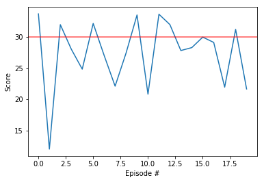

# Project 2: Continuous Control Report

## Introduction

This project was made as a part of the Deep Reinforcement Learning Nanodegree. 
A DDPG agent is trained to operate a double jointed arm. The goal is to reach an object. Unity environment is used for training. 
The code is written in Python 3 and Pytorch.

## Agent
 - As mentioned earlier a DDPG agent is built using Pytorch.
 - A simple two hidden-layer neural network is used to build the actor and the critic networks.
 - The Network Architecture for the Actor looked like this: 
    - **State => (512 + BatchNorm + ReLU) => (256 + BatchNorm + ReLU)  => (Actions + tanh)**

- The Network Architecture for the Critic looked like this: 
    - **State => (512+action_size + BatchNorm + ReLU) => (256 + BatchNorm + ReLU)  => Actions**

- Parameters:

    - **`Epsiodes`** - Max number of training episodes: 2000.
    - **`Actor Learning Rate`** - Used a learning rate of 1e-3.
    - **`Critic Learning Rate`** - Used a learning rate of 1e-3.
    - **`Timesteps`** - Max Timesteps per episode: 1000.
    - **`Buffer Size`** - Used a buffer of size 1e6.
    - **`Activation`** - Used Rectified Linear Unit. 
    - **`Batch Size`** - Used a batch size of 128.
    - **`Tau`** - Parameter for Soft-Updates was 1e-3.
    - **`Learn Rvery`** - Parameter for model updates.
    - **`Learn For`** - Parameter for model training.
    - **`Optimizer`** - Used Adam Optimizer.
    - **`Gamma`** - Discount Factor of 0.99.

## Training
- `Continuous_Control.ipynb` can be used to train the agent and play around with the environment.
- The agent was able to solve the environment in ~349 episodes.
- The training plot looked like this:

## Future Work
- I plan on implementing Prioritized Replay Buffer and evaluate the change in performance.
- Following this I wish to try out VPG, TRPO, PPO, A2C and D4PG.
- I plan on implementing these algorithms to compare their performance with the DDPG.
    